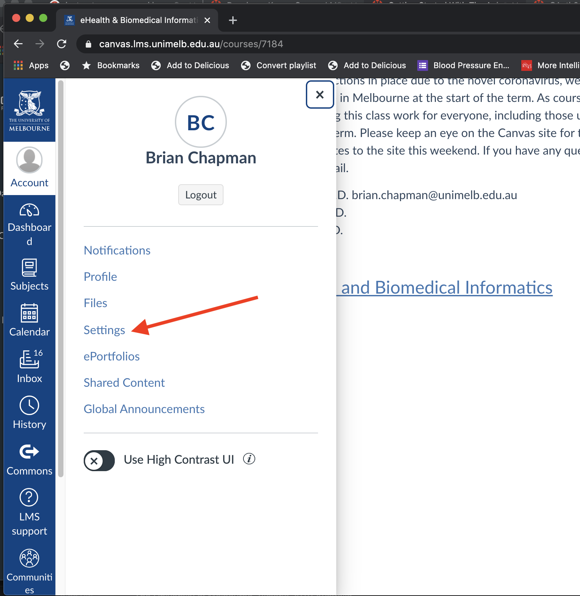
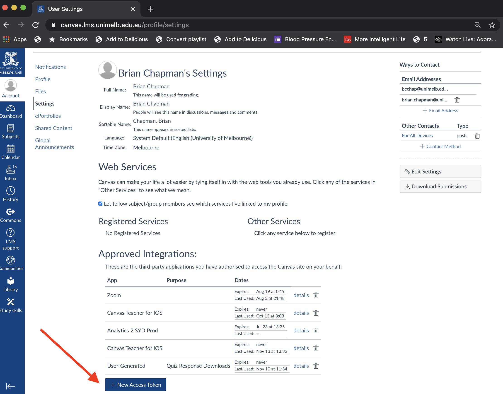
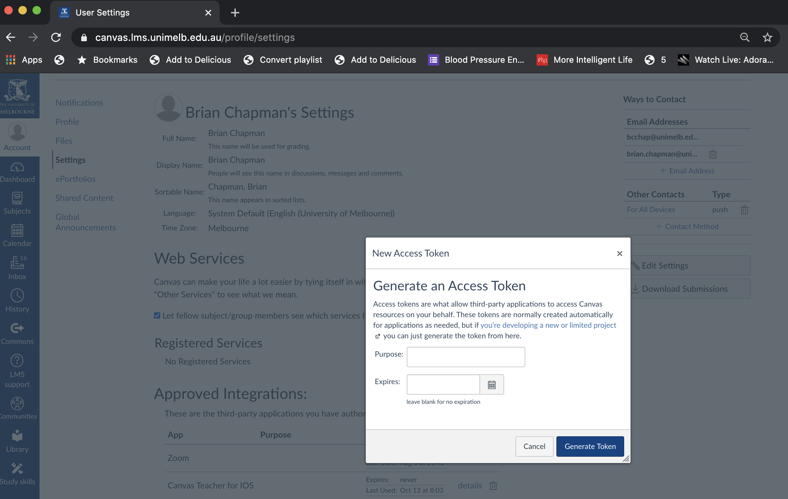

## Get Canvas Access Token

The first step to accessing your Canvas data is to get an __access token__. Instructions for this can be found [here](https://canvas.instructure.com/courses/785215/pages/getting-started-with-the-api) on the Canvas documentation.

Here are some screenshots from my account showing the steps to create the token.





When you click on the generate token button, a new window will be shown which has your token. This needs to be copied and saved to a secure location on your computer; we will create code that needs to read this token in order to access your Canvas account. I put mine in a file named `aggregate_token` in a hidden directory in my home directory named `.canvaslms`.

## Creating an Environment

- Clone this repository
- In the top level directory of the repository (where `environment.yml` is located), run the following command:

```bash
conda env create --name environment.yml
```
- After the environment is created, activate the environment

```bash
conda activate student_data
```

- Then execute the following command

```bash
python code/canvas/test_canvas1.py
```

The output should look something like the following with my name replaced with your name and my classes replaced with your classes:

```bash
(student_data) bucksaw:student_data brian$ python code/canvas/test_canvas1.py
User:  Brian Chapman (13xxxx)
My courses
MAST90134_2020_TM2 Advanced Elements of Analytics (MAST90134_2020_TM2  (Online)) (16xxx)
HLTH90006_2020_SM1 Basics of Digital Health for Clinicians (HLTH90006_2020_SM1  (Online)) (14xxx)
HLTH90006_2020_SM2 Basics of Digital Health for Clinicians (HLTH90006_2020_SM2  (Online)) (14xxx)
POPH90295_BLPRINT Blueprint: Designing Analytics Investigations (84xxx)
POPH90294_2020_SM2_PAR_2 Consumer Participatory Health Technology (POPH90294_2020_SM2_PAR_2  (Online)) (111xxx)
ISYS90069_2020_SM1 eHealth & Biomedical Informatics Systems (ISYS90069_2020_SM1) (7xxx)
ISYS90069_2020_WIN eHealth & Biomedical Informatics Systems (ISYS90069_2020_WIN  (Online)) (110xxx)
COM_COM_000125 Health Informatics & Digital Health Postgrad Students (99xxx)
PPbcchap Playpen: Brian Chapman (96xxx)
TWCbcchap Teaching with Canvas: Brian Chapman (96xxx)
COM_COM_000542 What I Now Know  Educator: WINKed (109xxx)
```
